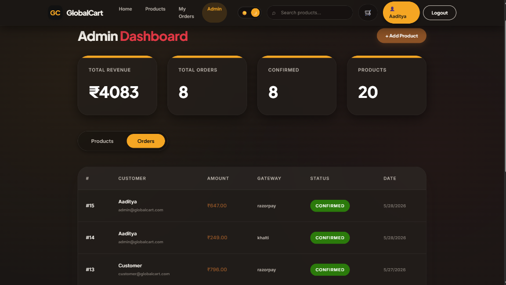
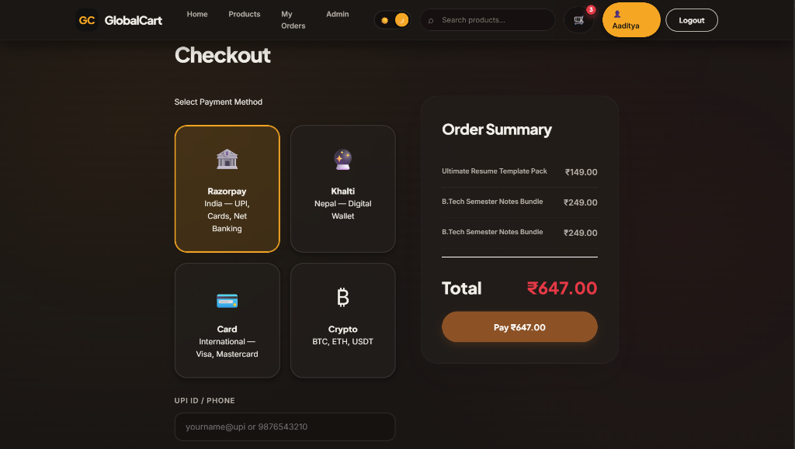
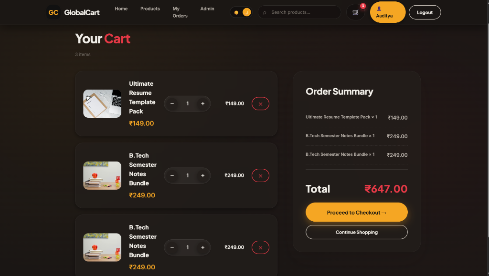

# 🛒 GlobalCart — Digital Products Marketplace

<div align="center">
  
  
  
  
  <br><br>
  <i>A robust, database-driven Single Page Application (SPA) designed for instant delivery of digital products.</i>
</div>

<br>

## 📸 UI Showcase

<div align="center">
  
  <br><i>Premium Home Page with Glassmorphism Design</i><br><br>
  
  
  <br><i>Dynamic Products Catalog and Filtering</i><br><br>
  
  
  <br><i>Interactive Cart Management</i><br><br>
  
  
  <br><i>Secure Checkout with Multiple Payment Gateways</i><br><br>
  
  
  <br><i>Admin Dashboard for Revenue and Order Tracking</i><br>
</div>

---

## 📖 About the Project

**GlobalCart** is a modern e-commerce platform built exclusively for digital goods such as e-books, software, notes, and courses. Unlike traditional e-commerce stores optimized for physical shipping, this platform is engineered for **instant digital delivery**, utilizing a highly normalized MySQL relational database to handle users, products, carts, and transactions securely.

This project was built as a comprehensive **Database Management Systems (DBMS) Mini-Project** to demonstrate practical applications of advanced database concepts including relational schemas, referential integrity (foreign keys), connection pooling, and transactional safety.

---

## 🧠 Deep Dive: Database Design & Data Flow

This project is built heavily around relational database principles. Below is a detailed explanation of how the data flows, how the tables are connected, and how advanced DBMS concepts are implemented.

### 1. The Project Data Flow

```
┌──────────┐    ┌──────────────┐    ┌──────────────────┐    ┌──────────┐
│  Browser │───▶│  Flask API   │───▶│  Connection Pool │───▶│  MySQL   │
│  (SPA)   │◀───│  (Python)    │◀───│  (10 connections)│◀───│  Server  │
└──────────┘    └──────────────┘    └──────────────────┘    └──────────┘
```

1. **User Registration:** A user signs up. The backend hashes their password and `INSERT`s a new row into the `users` table. The `email` and `username` columns have `UNIQUE` constraints to prevent duplicates.
2. **Browsing Products:** When the user opens the homepage, the backend runs a `SELECT * FROM products` query. The frontend dynamically renders these products.
3. **Adding to Cart:** When the user clicks "Add to Cart", an `INSERT` statement is executed on the `cart` table. This table acts as a bridge, linking the `user_id` and the `product_id`.
4. **Checkout (Transactions):** During checkout, a highly complex **Database Transaction** occurs:
   - The system calculates the total cart value.
   - An `INSERT` is made into the `orders` table to generate a unique `order_id`.
   - The system then iterates through the user's cart and `INSERT`s multiple rows into the `order_items` table.
   - Finally, a `DELETE` query empties the user's cart.
   - *Crucially*, all of these steps happen inside a single transaction. If any step fails, the entire transaction **Rolls Back** to ensure the database doesn't end up in a corrupted state.

### 2. How Foreign Keys & Table Connections Work

Foreign Keys (FK) are used to maintain **Referential Integrity**. They ensure that you cannot have a record in one table that points to a non-existent record in another table.

```
┌─────────┐       ┌─────────┐       ┌──────────┐
│  users  │──1:N──│  cart   │──N:1──│ products │
│  (PK:id)│       │(FK:both)│       │  (PK:id) │
└────┬────┘       └─────────┘       └────┬─────┘
     │                                    │
     │ 1:N                           N:M  │
     ▼                                    ▼
┌─────────┐       ┌─────────────┐         │
│  orders │──1:N──│ order_items │─────────┘
│  (PK:id)│       │ (FK: both)  │
└─────────┘       └─────────────┘
```

* **`cart` Table Connections:** The `cart` table connects a User to a Product. `user_id (FK)` references `users(id)` and `product_id (FK)` references `products(id)`. *You cannot add an item to the cart for a user that doesn't exist, nor can you add a product that doesn't exist.*

* **Resolving Many-to-Many Relationships (`order_items`):** An Order can contain many Products, and a Product can belong to many Orders. Databases cannot handle Many-to-Many relationships directly. We use a **Junction Table** called `order_items` which contains `order_id (FK)` referencing `orders(id)` and `product_id (FK)` referencing `products(id)`.

### 3. Key DBMS Concepts Implemented

* **ON DELETE CASCADE:** If an Admin deletes a Product, MySQL automatically deletes any `cart` rows containing that `product_id`. This prevents "Orphaned Records".
* **Historical Data Preservation (`price_at_time`):** The `order_items` table stores the `unit_price` at the moment of purchase. If an admin changes the price later, past orders remain unaffected.
* **Connection Pooling:** Instead of opening/closing a connection on every request, `mysql.connector.pooling` keeps 10 connections alive at all times for speed and stability.

---

## ⚡ Key Features

| Feature | Description |
|:---|:---|
| 🔐 **Secure Auth** | Registration & login with hashed passwords, role-based access (Customer / Admin) |
| 🛍️ **Product Catalog** | Live MySQL queries, category filtering, single-page UI with no reloads |
| 🛒 **Cart Management** | Persistent DB-backed cart, real-time quantity adjustments |
| 💳 **Transactional Checkout** | ACID-compliant order generation with rollback safety |
| 📊 **Admin Dashboard** | Aggregation queries (`COUNT`, `SUM`) for sales analytics |
| 🎨 **Premium UI** | Glassmorphism, warm editorial palette, micro-animations |

---

## 🏗️ Technology Stack

| Layer | Technologies Used |
|:---|:---|
| **Frontend** | HTML5, Vanilla JavaScript, Custom CSS (Glassmorphism, CSS Variables) |
| **Backend API** | Python, Flask, Flask Blueprints |
| **Database** | MySQL 8.0+ (with `mysql.connector.pooling`) |
| **Security** | Server-side Sessions, PBKDF2-SHA256 Password Hashing, Parameterized Queries |

---

## 📂 Folder Structure

```text
GlobalCart/
│
├── api/                    # Flask Blueprints (REST API Endpoints)
│   ├── auth.py             # Login, Register, Session Management
│   ├── products.py         # Product fetching and catalog
│   ├── cart.py             # Cart operations (Add, Remove, Update)
│   └── orders_payments.py  # Checkout logic and transactional inserts
│
├── static/                 # Static Assets
│   ├── css/main.css        # Premium Glassmorphism styling
│   └── js/app.js           # Vanilla JS SPA routing and API fetching
│
├── templates/              # HTML Views
│   └── index.html          # Main SPA entry point
│
├── .env                    # Environment variables (NOT committed to Git)
├── .gitignore              # Secures .env & __pycache__
├── app.py                  # Main Flask application entry point
├── db.py                   # MySQL Connection Pooling configuration
├── requirements.txt        # Python dependencies
└── schema.sql              # Database schema and seed data
```

---

## 💻 Codebase & Implementation Details

To fully understand the project, here is a detailed breakdown of how the core files and code logic operate:

### 1. The Database Schema (`schema.sql`)
This file is the backbone of the application. It contains all the DDL (Data Definition Language) commands to construct the database.

* **`users` Table:** Stores credentials. Notice the `UNIQUE` constraints on username and email to prevent duplicates at the database level.
* **`products` & `categories` Tables:** Core catalog data. The `product_category` table maps them together using Foreign Keys to resolve the Many-to-Many relationship.
* **`cart` Table:** A bridge table linking `users` and `products`. It uses `ON DELETE CASCADE` for both Foreign Keys so if a user or product is deleted, the cart is automatically cleaned up.
* **`orders`, `order_items`, and `payments` Tables:** The financial core. `order_items` stores the `unit_price` explicitly to freeze the price at the moment of checkout, protecting historical order totals even if the admin changes product prices later.

### 2. Connection Pooling (`db.py`)
Instead of opening a new database connection for every single user request (which is slow and resource-heavy), we use `mysql.connector.pooling`.
* At startup, the app creates a "pool" of 10 persistent connections.
* When a user visits the site, the app borrows one connection, runs the SQL query, and immediately returns the connection to the pool. This allows the app to handle high concurrency efficiently.

### 3. The Backend API (`api/` folder & `app.py`)
The backend is written in Python using the **Flask** framework and is divided into "Blueprints" for clean architecture:
* **`app.py`:** The main entry point. It initializes the Flask server, configures secure server-side sessions, and registers the Blueprints.
* **`auth.py`:** Handles security. Uses `werkzeug.security` to run `generate_password_hash` (PBKDF2-SHA256) on user passwords before `INSERT`ing them into the DB.
* **`products.py`:** Runs `SELECT` queries to fetch product data and sends it to the frontend as JSON.
* **`orders_payments.py`:** The most complex file. It contains the **Checkout Transaction**. It starts a database transaction, inserts into `orders`, iterates over the cart to insert into `order_items`, and deletes from `cart`. If *any* SQL command fails, it calls `conn.rollback()` to undo everything, ensuring ACID compliance.

### 4. The Frontend (`static/js/app.js` & `index.html`)
The project is a **Single Page Application (SPA)**. 
* There are no page reloads. Instead, `app.js` uses JavaScript `fetch()` API calls to communicate with the Flask backend.
* When you click "Products", JavaScript fetches the JSON data from MySQL via the backend, and dynamically constructs the HTML cards on the screen.
* The UI is styled with raw CSS (`main.css`), utilizing CSS Variables and Glassmorphism for a premium aesthetic.

---

## 🚀 Installation & Setup

### Prerequisites
1. **Python 3.10+** installed.
2. **MySQL Server** installed and running (via XAMPP, WAMP, or standalone).

### Step 1: Clone the Repository
```bash
git clone https://github.com/adityasing9/GlobalCart.git
cd GlobalCart
```

### Step 2: Configure the Database
1. Open your MySQL client (e.g., MySQL Workbench, phpMyAdmin).
2. Execute the entire SQL script located in `schema.sql`. This will create the `globalcart` database, build all the necessary tables, and insert sample products.

### Step 3: Set up Environment Variables
Create a file named `.env` in the root directory:
```env
MYSQL_HOST=localhost
MYSQL_PORT=3306
MYSQL_USER=root
MYSQL_PASSWORD=your_mysql_password
MYSQL_DATABASE=globalcart
SECRET_KEY=your_super_secret_flask_key
```

### Step 4: Install Dependencies & Run
```bash
python -m venv venv
venv\Scripts\activate          # Windows
# source venv/bin/activate     # macOS / Linux

pip install -r requirements.txt
python app.py
```
**Access the app:** Open your browser → `http://127.0.0.1:5000`

---

<br>

# 📚 DBMS Viva / Defense — Complete Question Bank

> The following sections contain **100+ questions** with detailed answers, organized by topic. These cover everything a professor may ask during a DBMS mini-project viva or external examination.

---

## 🏛️ Section 1: Database Design & Architecture

<details>
<summary><b>Q1. Why did you choose a relational database instead of NoSQL for e-commerce?</b></summary>
<br>

E-commerce has highly **structured, interrelated data** — users place orders, orders contain products, products belong to categories. These are natural relationships that map perfectly to tables with Foreign Keys.

**Why Relational (MySQL) wins here:**
| Criteria | Relational (MySQL) | NoSQL (MongoDB) |
|:---|:---|:---|
| Data Relationships | Excellent (JOINs, FKs) | Poor (no native JOINs) |
| Transactions (ACID) | Full support | Limited |
| Data Integrity | Enforced by schema | Application must enforce |
| Consistency | Strong consistency | Eventual consistency |

NoSQL databases like MongoDB are better for unstructured data (e.g., social media feeds, IoT sensor data). But for financial transactions where you **cannot afford data corruption** (e.g., charging a customer but not creating their order), a relational database with ACID compliance is the only safe choice.

</details>

<details>
<summary><b>Q2. Why is <code>order_items</code> separated from <code>orders</code>?</b></summary>
<br>

Because one order can contain **multiple products**. If we stored product details directly inside the `orders` table, we would need to either:
- Create columns like `product_1`, `product_2`, `product_3`... which is terrible design (what if someone buys 50 items?), or
- Repeat the entire order information (date, user, total) for each product, causing massive **data redundancy**.

Instead, we use the normalized approach:
```
orders table:        order_id=101, user_id=5, total=748.00
order_items table:   order_id=101, product_id=3, unit_price=299.00
                     order_id=101, product_id=7, unit_price=449.00
```
The `orders` table stores the order metadata **once**, and `order_items` stores each product in that order as a separate row. This is **Third Normal Form (3NF)**.

</details>

<details>
<summary><b>Q3. Why did you create a junction table (<code>product_category</code>)?</b></summary>
<br>

A product can belong to **multiple categories** (e.g., "Machine Learning Crash Course" belongs to both "AI Resources" and "Programming"), and a category can contain **multiple products**. This is a **Many-to-Many (M:N) relationship**.

Relational databases cannot store M:N relationships directly. The solution is a **junction table** (also called a bridge/mapping/associative table):

```sql
CREATE TABLE product_category (
    product_id INT,      -- FK → products(id)
    category_id INT,     -- FK → categories(id)
    PRIMARY KEY (product_id, category_id)  -- Composite Primary Key
);
```

This table contains no data of its own — it simply links two IDs together.

</details>

<details>
<summary><b>Q4. What normalization level does your database satisfy?</b></summary>
<br>

Our database satisfies **Third Normal Form (3NF)**:

| Normal Form | Rule | Our Database |
|:---|:---|:---|
| **1NF** | No repeating groups; every column holds atomic values | ✅ All columns are atomic (no arrays or comma-separated lists) |
| **2NF** | No partial dependencies (every non-key column depends on the *entire* primary key) | ✅ In `order_items`, `unit_price` depends on the full composite key (order_id + product_id), not just one of them |
| **3NF** | No transitive dependencies (non-key columns don't depend on other non-key columns) | ✅ In `orders`, `total_amount` depends directly on `order_id`, not on `user_id` |

</details>

<details>
<summary><b>Q5. What redundancy problems would occur without normalization?</b></summary>
<br>

Without normalization, we'd face three critical **anomalies**:

1. **Insert Anomaly:** To add a new product category, we would need to also insert a dummy product row because the category data would be embedded inside the product table.
2. **Update Anomaly:** If a product's price changes, we'd need to update it in every single order row that contains it. Miss one row and the database becomes **inconsistent**.
3. **Delete Anomaly:** If we delete the last product in a category, we'd accidentally lose the category information too.

Our normalized design with separate tables for `products`, `categories`, `orders`, and `order_items` eliminates all three anomalies.

</details>

<details>
<summary><b>Q6. How would you redesign this database for millions of users?</b></summary>
<br>

1. **Add Indexes** on frequently queried columns: `users.email`, `products.category`, `orders.user_id`, `orders.created_at`.
2. **Database Sharding:** Split the `orders` table across multiple database servers based on `user_id` ranges (e.g., users 1-1M on Server A, 1M-2M on Server B).
3. **Read Replicas:** Create read-only copies of the database. Product browsing queries hit replicas; writes (cart, checkout) hit the primary.
4. **Caching Layer:** Use Redis to cache the product catalog (which changes rarely) to reduce database load by 80%+.
5. **Archive Old Orders:** Move orders older than 2 years into a separate `orders_archive` table to keep the active table small and fast.

</details>

<details>
<summary><b>Q7. What are the tradeoffs between normalization and denormalization?</b></summary>
<br>

| Aspect | Normalization | Denormalization |
|:---|:---|:---|
| **Data Redundancy** | Minimal (no duplicate data) | High (data is duplicated intentionally) |
| **Write Performance** | Fast (update one place) | Slow (must update everywhere) |
| **Read Performance** | Slower (requires JOINs) | Faster (data is pre-combined) |
| **Data Integrity** | High (single source of truth) | Risk of inconsistency |
| **Best For** | Transactional systems (OLTP) | Analytical/reporting systems (OLAP) |

**Our choice:** We use normalization because e-commerce is write-heavy (cart updates, orders) and data integrity is critical. We accept slower reads (JOINs) because our dataset is not large enough for it to matter.

</details>

<details>
<summary><b>Q8. Why is the Many-to-Many relationship needed in your project?</b></summary>
<br>

Two real-world relationships in our project are naturally Many-to-Many:

1. **Products ↔ Categories:** A "Python Mastery Bundle" can be tagged under both "Programming" and "Career". A "Programming" category contains many products. → Resolved by `product_category` junction table.
2. **Orders ↔ Products:** One order can contain 5 different products. One product (like "GATE Notes") can appear in thousands of different orders. → Resolved by `order_items` junction table.

Without junction tables, we'd need to store comma-separated product IDs inside the orders table (e.g., `products="3,7,12"`), which **violates 1NF** and makes querying, filtering, and JOINing impossible.

</details>

<details>
<summary><b>Q9. What happens if foreign keys are removed?</b></summary>
<br>

The database loses **referential integrity**. Specific disasters:

1. **Ghost Orders:** Delete a user → their orders remain in the `orders` table pointing to a `user_id` that no longer exists. No way to know whose order it was.
2. **Phantom Cart Items:** Delete a product → cart rows still reference a `product_id` that doesn't exist. The frontend will crash trying to display a nonexistent product.
3. **Invalid Data Entry:** An INSERT into `cart` with `product_id = 99999` would succeed even though product 99999 doesn't exist.

**With Foreign Keys:** MySQL rejects all of these operations immediately with an error, protecting data integrity.

</details>

<details>
<summary><b>Q10. Why should cart and orders be separate tables?</b></summary>
<br>

Because they represent **fundamentally different stages** in the customer lifecycle:

| Aspect | `cart` | `orders` |
|:---|:---|:---|
| **Purpose** | Temporary storage (intent to buy) | Permanent record (confirmed purchase) |
| **Mutability** | Constantly changing (add/remove items) | Immutable once placed |
| **Lifecycle** | Deleted after checkout | Preserved forever |
| **Financial Impact** | None (no money exchanged) | Represents a financial transaction |

Combining them would mean adding a `status` column ("in_cart" vs "ordered") and make queries extremely confusing and error-prone.

</details>

---

## 🔗 Section 2: Foreign Key & Relationship Questions

<details>
<summary><b>Q11. Why did deletion fail when deleting users?</b></summary>
<br>

When you try to delete a user who has existing orders, MySQL throws a **Foreign Key constraint violation**:

```
ERROR 1451: Cannot delete or update a parent row: 
a foreign key constraint fails (`orders`.`user_id`)
```

This happens because the `orders` table has a Foreign Key `user_id` referencing `users(id)`. MySQL **refuses to delete the parent** (user) while **child records** (orders) still reference it.

**Solutions:**
1. `ON DELETE CASCADE` — Automatically delete all of the user's orders when the user is deleted.
2. `ON DELETE SET NULL` — Set `user_id` to NULL in orders (preserves order history but loses user association).
3. **Soft Delete** — Add an `is_active` column to users instead of actually deleting the row.

</details>

<details>
<summary><b>Q12. Explain parent-child relationship in your schema.</b></summary>
<br>

A **parent table** is the one whose Primary Key is referenced. A **child table** is the one containing the Foreign Key.

```
Parent: users (id)          →  Child: orders (user_id FK)
Parent: users (id)          →  Child: cart (user_id FK)
Parent: products (id)       →  Child: cart (product_id FK)
Parent: orders (id)         →  Child: order_items (order_id FK)
Parent: products (id)       →  Child: order_items (product_id FK)
Parent: orders (id)         →  Child: payments (order_id FK)
```

**Rule:** You must create the parent before the child. You cannot insert an order for a user who doesn't exist yet.

</details>

<details>
<summary><b>Q13. Why are foreign keys important in e-commerce?</b></summary>
<br>

In e-commerce, data is **financial and legally sensitive**. Foreign keys guarantee:

1. **Every order belongs to a real user** — You can't generate a phantom order for a nonexistent customer.
2. **Every cart item is a real product** — Users can't add fake product IDs to their cart to manipulate pricing.
3. **Every payment links to a real order** — Financial transactions are always traceable and auditable.

Without FKs, the database is just a collection of unrelated data with no guarantees of correctness.

</details>

<details>
<summary><b>Q14. What are orphan records?</b></summary>
<br>

Orphan records are rows in a child table that reference a parent row **that no longer exists**.

**Example:** If we delete `users` WHERE `id = 5` without cascading, then the following rows become orphans:
```
cart:         user_id=5, product_id=3    ← orphan (user 5 is gone)
orders:       user_id=5, total=499.00    ← orphan (user 5 is gone)
```

These rows consume storage, corrupt reports (`SUM` of all orders will include orders from a ghost user), and crash the frontend when it tries to display the user's name.

</details>

<details>
<summary><b>Q15. What is cascading delete?</b></summary>
<br>

`ON DELETE CASCADE` is a Foreign Key rule that says: **"When the parent row is deleted, automatically delete all child rows that reference it."**

```sql
FOREIGN KEY (user_id) REFERENCES users(id) ON DELETE CASCADE
```

**In our project:**
- Deleting a user → automatically deletes their cart items, orders, and payments.
- Deleting a product → automatically removes it from all carts.

This keeps the database clean without requiring the application to manually run dozens of DELETE queries.

</details>

<details>
<summary><b>Q16. Why did your project not automatically delete child records?</b></summary>
<br>

We intentionally use CASCADE only on `cart` (temporary data) but **not** on `orders`. Reason: If an admin accidentally deletes a user, we don't want to lose their entire purchase history and financial records.

For orders, we use the default behavior `ON DELETE RESTRICT` — MySQL blocks the deletion and forces the admin to handle the situation explicitly (e.g., reassigning the orders or archiving them first).

</details>

<details>
<summary><b>Q17. Difference between ON DELETE CASCADE and manual deletion?</b></summary>
<br>

| Aspect | ON DELETE CASCADE | Manual Deletion |
|:---|:---|:---|
| **Who handles it** | MySQL engine (automatic) | Application code (developer writes DELETE queries) |
| **Speed** | Extremely fast (engine-level) | Slower (multiple round-trips to DB) |
| **Risk of bugs** | None (guaranteed by engine) | High (developer might forget a child table) |
| **Atomicity** | Atomic (all or nothing) | Not atomic unless wrapped in a transaction |
| **Flexibility** | Fixed behavior | Can add custom logic (e.g., archiving before deletion) |

</details>

<details>
<summary><b>Q18. What problems occur without referential integrity?</b></summary>
<br>

1. **Data Corruption:** Orders pointing to deleted users. Payments pointing to deleted orders.
2. **Incorrect Reports:** `SELECT SUM(total_amount) FROM orders` would include amounts from ghost orders.
3. **Application Crashes:** Frontend tries to JOIN orders with users, but `user_id=5` doesn't exist → null reference errors.
4. **Security Holes:** An attacker could INSERT arbitrary `product_id` values into their cart, potentially exploiting pricing bugs.

</details>

<details>
<summary><b>Q19. Explain One-to-Many relationship with your tables.</b></summary>
<br>

**One User → Many Orders:** A single user (id=5) can place 10, 100, or 1000 orders over time. But each order belongs to exactly one user.

```sql
-- Find all orders by user "Aaditya"
SELECT o.id, o.total_amount, o.status
FROM orders o
JOIN users u ON o.user_id = u.id
WHERE u.username = 'Aaditya';
```

The `user_id` FK inside the `orders` table creates this 1:N link.

</details>

<details>
<summary><b>Q20. Explain Many-to-Many relationship with your tables.</b></summary>
<br>

**Orders ↔ Products:** Order #101 contains Product #3 and Product #7. Product #3 also appears in Order #88 and Order #205.

This is resolved by the `order_items` junction table:
```
order_items:
  order_id=101, product_id=3, unit_price=299.00
  order_id=101, product_id=7, unit_price=449.00
  order_id=88,  product_id=3, unit_price=299.00
```

```sql
-- Find all products in Order #101
SELECT p.name, oi.unit_price
FROM order_items oi
JOIN products p ON oi.product_id = p.id
WHERE oi.order_id = 101;
```

</details>

---

## 💻 Section 3: SQL Query Questions

<details>
<summary><b>Q21. Write a query to find total sales.</b></summary>
<br>

```sql
-- Total revenue from all confirmed orders
SELECT SUM(total_amount) AS total_revenue
FROM orders
WHERE status = 'Confirmed';
```

**Output:** `total_revenue: 45,230.00`

For the admin dashboard, we also show count:
```sql
SELECT COUNT(*) AS total_orders, SUM(total_amount) AS total_revenue
FROM orders
WHERE status = 'Confirmed';
```

</details>

<details>
<summary><b>Q22. Write a query to show all orders of a user.</b></summary>
<br>

```sql
SELECT o.id AS order_id,
       o.total_amount,
       o.status,
       o.created_at,
       GROUP_CONCAT(p.name SEPARATOR ', ') AS products
FROM orders o
JOIN order_items oi ON o.id = oi.order_id
JOIN products p ON oi.product_id = p.id
WHERE o.user_id = 5
GROUP BY o.id
ORDER BY o.created_at DESC;
```

This uses a **three-table JOIN** (orders → order_items → products) and `GROUP_CONCAT` to list all product names per order in a single row.

</details>

<details>
<summary><b>Q23. Write a query to show top-selling products.</b></summary>
<br>

```sql
SELECT p.name,
       p.price,
       COUNT(oi.id) AS times_purchased,
       SUM(oi.unit_price * oi.quantity) AS total_revenue
FROM products p
JOIN order_items oi ON p.id = oi.product_id
GROUP BY p.id
ORDER BY times_purchased DESC
LIMIT 5;
```

This uses `GROUP BY` with aggregate functions `COUNT` and `SUM` to rank products by popularity.

</details>

<details>
<summary><b>Q24. Difference between WHERE and HAVING?</b></summary>
<br>

| Aspect | `WHERE` | `HAVING` |
|:---|:---|:---|
| **Filters** | Individual rows *before* grouping | Groups *after* `GROUP BY` |
| **Can use aggregates?** | ❌ No | ✅ Yes (`COUNT`, `SUM`, etc.) |
| **Execution order** | Runs first | Runs after GROUP BY |

```sql
-- WHERE: Filter rows before grouping
SELECT * FROM products WHERE price > 200;

-- HAVING: Filter groups after aggregation
SELECT category, COUNT(*) AS product_count
FROM products
GROUP BY category
HAVING COUNT(*) > 3;   -- Only categories with more than 3 products
```

</details>

<details>
<summary><b>Q25. Difference between INNER JOIN and LEFT JOIN?</b></summary>
<br>

```sql
-- INNER JOIN: Only users WHO HAVE orders
SELECT u.username, o.id FROM users u
INNER JOIN orders o ON u.id = o.user_id;
-- Result: Users with 0 orders are EXCLUDED

-- LEFT JOIN: ALL users, even those without orders
SELECT u.username, o.id FROM users u
LEFT JOIN orders o ON u.id = o.user_id;
-- Result: Users with 0 orders show NULL for order columns
```

| Type | Returns |
|:---|:---|
| INNER JOIN | Only rows with matches in **both** tables |
| LEFT JOIN | All rows from **left** table + matches from right (NULL if no match) |
| RIGHT JOIN | All rows from **right** table + matches from left |
| FULL JOIN | All rows from **both** tables |

</details>

<details>
<summary><b>Q26. Write a JOIN query using your project tables.</b></summary>
<br>

```sql
-- Show cart contents with product details for user_id = 5
SELECT c.id AS cart_id,
       p.name AS product_name,
       p.price,
       c.quantity,
       (p.price * c.quantity) AS subtotal
FROM cart c
INNER JOIN products p ON c.product_id = p.id
WHERE c.user_id = 5;
```

This JOIN replaces the raw `product_id` number with the actual product name and price, and calculates the subtotal per item.

</details>

<details>
<summary><b>Q27. What is a subquery? Show a project example.</b></summary>
<br>

A **subquery** is a query nested inside another query. It executes first, and its result is used by the outer query.

```sql
-- Find users who have spent more than the average order amount
SELECT u.username, o.total_amount
FROM users u
JOIN orders o ON u.id = o.user_id
WHERE o.total_amount > (
    SELECT AVG(total_amount) FROM orders    -- Subquery runs first
);
```

Another example:
```sql
-- Find products that have NEVER been ordered
SELECT name FROM products
WHERE id NOT IN (
    SELECT DISTINCT product_id FROM order_items
);
```

</details>

<details>
<summary><b>Q28. What are aggregate functions?</b></summary>
<br>

Aggregate functions perform calculations on a **set of rows** and return a single value:

| Function | Purpose | Example |
|:---|:---|:---|
| `COUNT()` | Count rows | `SELECT COUNT(*) FROM users` → 150 |
| `SUM()` | Total value | `SELECT SUM(total_amount) FROM orders` → 45230.00 |
| `AVG()` | Average | `SELECT AVG(price) FROM products` → 349.00 |
| `MAX()` | Maximum | `SELECT MAX(price) FROM products` → 599.00 |
| `MIN()` | Minimum | `SELECT MIN(price) FROM products` → 149.00 |

Our admin dashboard uses `COUNT` and `SUM` heavily for real-time analytics.

</details>

<details>
<summary><b>Q29. Difference between DELETE, DROP, and TRUNCATE?</b></summary>
<br>

| Command | What it does | Reversible? | Speed |
|:---|:---|:---|:---|
| `DELETE FROM orders WHERE id=5` | Removes specific rows | ✅ Yes (with ROLLBACK in a transaction) | Slow (row-by-row, logs each deletion) |
| `TRUNCATE TABLE orders` | Removes ALL rows but keeps table structure | ❌ No (cannot rollback) | Very fast (deallocates pages) |
| `DROP TABLE orders` | Destroys the entire table (structure + data) | ❌ No | Instant |

```sql
DELETE FROM cart WHERE user_id = 5;     -- Remove one user's cart (safe, logged)
TRUNCATE TABLE cart;                     -- Empty ALL carts (fast, no undo)
DROP TABLE cart;                         -- Table no longer exists
```

</details>

<details>
<summary><b>Q30. What is indexing and where would you apply it?</b></summary>
<br>

An **index** is a data structure (usually a B-Tree) that allows MySQL to find rows **without scanning the entire table**.

**Without index:** MySQL reads all 10 million rows to find `WHERE email = 'abc@gmail.com'` (Full Table Scan = slow).

**With index:** MySQL uses the B-Tree to jump directly to the matching row (Index Lookup = instant).

**Where to apply in our project:**
```sql
CREATE INDEX idx_users_email ON users(email);            -- Login queries
CREATE INDEX idx_cart_user ON cart(user_id);              -- Cart lookups
CREATE INDEX idx_orders_user ON orders(user_id);          -- Order history
CREATE INDEX idx_order_items_order ON order_items(order_id); -- Order details
CREATE INDEX idx_products_category ON products(category);  -- Category filtering
```

</details>

---

## ⚡ Section 4: Performance & Optimization Questions

<details>
<summary><b>Q31. How would your database behave with 10 million orders?</b></summary>
<br>

**Without optimization:** Queries like `SELECT * FROM orders WHERE user_id = 5` would trigger a **Full Table Scan** — MySQL reads all 10 million rows to find a handful of matches. Response time could be 10-30 seconds.

**With optimization:**
1. **Index on `user_id`:** Reduces the search from 10M rows to ~50 rows instantly (B-Tree lookup).
2. **Partitioning by date:** Split the orders table by year so queries only scan the relevant partition.
3. **Connection pooling:** Prevents connection exhaustion under high concurrent load.

</details>

<details>
<summary><b>Q32. Which columns should be indexed?</b></summary>
<br>

Index columns that appear in:
- **WHERE clauses:** `users.email`, `orders.user_id`, `orders.status`
- **JOIN conditions:** `order_items.order_id`, `order_items.product_id`, `cart.user_id`
- **ORDER BY:** `orders.created_at`, `products.sales_count`
- **UNIQUE constraints:** Already automatically indexed (`users.email`, `users.username`)

**Do NOT index:** Columns with low cardinality (e.g., `role` which only has 2 values: 'user' and 'admin') or columns rarely used in queries.

</details>

<details>
<summary><b>Q33. How does indexing improve performance?</b></summary>
<br>

MySQL uses a **B-Tree** index structure:

```
Without Index (Full Table Scan):
Row 1 → Row 2 → Row 3 → ... → Row 10,000,000 → Found!
Time: O(n) = 10 million comparisons

With Index (B-Tree Lookup):
Root → Branch → Branch → Leaf → Found!
Time: O(log n) = ~23 comparisons for 10 million rows
```

The index acts like a book's table of contents — instead of reading every page to find a topic, you jump directly to the right page.

</details>

<details>
<summary><b>Q34. What are disadvantages of excessive indexes?</b></summary>
<br>

1. **Slower WRITES:** Every `INSERT`, `UPDATE`, `DELETE` must also update all indexes on that table. More indexes = slower writes.
2. **Storage cost:** Indexes consume disk space (sometimes as much as the table itself).
3. **Maintenance overhead:** MySQL must rebuild indexes periodically.

**Rule of thumb:** Index columns used in frequent reads (WHERE/JOIN/ORDER BY). Don't index columns only used in SELECTs or columns that change constantly.

</details>

<details>
<summary><b>Q35. What is query optimization?</b></summary>
<br>

Query optimization is the process of rewriting SQL queries to execute faster:

```sql
-- BAD: Fetching everything and filtering in Python
SELECT * FROM products;  -- then filter in Python

-- GOOD: Let MySQL filter
SELECT * FROM products WHERE category = 'Programming' AND price < 400;

-- BAD: Using SELECT *
SELECT * FROM orders;

-- GOOD: Select only needed columns
SELECT id, total_amount, status FROM orders WHERE user_id = 5;

-- BAD: N+1 query problem
-- For each order, run a separate query for items

-- GOOD: Single JOIN query
SELECT o.*, oi.* FROM orders o JOIN order_items oi ON o.id = oi.order_id;
```

</details>

<details>
<summary><b>Q36. How would you reduce database response time?</b></summary>
<br>

1. **Add indexes** on frequently queried columns.
2. **Use connection pooling** (already implemented — 10 persistent connections).
3. **Avoid `SELECT *`** — only fetch needed columns.
4. **Use `LIMIT`** for paginated results.
5. **Cache hot data** in Redis (e.g., product catalog).
6. **Use `EXPLAIN`** to identify slow queries and optimize them.

</details>

<details>
<summary><b>Q37. How can caching improve e-commerce performance?</b></summary>
<br>

The product catalog is **read 1000x more than it's written**. Instead of querying MySQL on every page load:

```
Without Cache:  Browser → Flask → MySQL → Flask → Browser (50ms)
With Cache:     Browser → Flask → Redis → Flask → Browser (2ms)
```

Redis stores the product list in memory. When an admin adds/updates a product, we invalidate the cache. This reduces MySQL load by ~90% for the most common operation (browsing).

</details>

<details>
<summary><b>Q38. What happens if indexes are not used?</b></summary>
<br>

MySQL falls back to a **Full Table Scan** — it literally reads every single row in the table sequentially. For a table with 1 million rows, this means reading 1 million rows even if only 1 matches the WHERE condition.

Queries that take 2ms with an index could take 5-30 seconds without one.

</details>

<details>
<summary><b>Q39. How do JOINs affect performance?</b></summary>
<br>

JOINs can be expensive because MySQL must combine rows from multiple tables. Performance depends on:

1. **Indexes on JOIN columns:** `ON o.user_id = u.id` — if `user_id` is indexed, the JOIN is fast. Without an index, MySQL does a nested loop scan (extremely slow).
2. **Number of rows:** JOINing two tables with 1M rows each without indexes = 1 trillion comparisons in the worst case.
3. **JOIN type:** `INNER JOIN` is faster than `LEFT JOIN` because it can eliminate non-matching rows early.

**Our approach:** All FK columns used in JOINs are indexed by MySQL automatically (FK columns get implicit indexes).

</details>

<details>
<summary><b>Q40. What is an execution plan in SQL?</b></summary>
<br>

The `EXPLAIN` keyword shows **how MySQL plans to execute a query** — which indexes it will use, how many rows it expects to scan, and the join strategy.

```sql
EXPLAIN SELECT * FROM orders WHERE user_id = 5;
```

Output columns:
| Column | Meaning |
|:---|:---|
| `type` | `ref` (index used) vs `ALL` (full scan — bad!) |
| `key` | Which index MySQL chose |
| `rows` | Estimated rows to scan |
| `Extra` | `Using index` (good) or `Using filesort` (slow) |

If `type = ALL`, you need to add an index on that column immediately.

</details>

---

## 🔄 Section 5: Transaction & Concurrency Questions

<details>
<summary><b>Q41. What are ACID properties?</b></summary>
<br>

ACID is the gold standard for database transactions:

| Property | Meaning | Our Project Example |
|:---|:---|:---|
| **Atomicity** | All steps succeed, or none do | Checkout: order + order_items + cart deletion all succeed, or all roll back |
| **Consistency** | DB moves from one valid state to another | Foreign keys ensure order always references a real user |
| **Isolation** | Concurrent transactions don't interfere | Two simultaneous checkouts don't corrupt each other's totals |
| **Durability** | Committed data survives crashes | Once checkout is committed, the order persists even if the server crashes immediately after |

</details>

<details>
<summary><b>Q42. Explain transaction flow during checkout.</b></summary>
<br>

```python
conn = get_db()
try:
    cursor = conn.cursor()
    
    # Step 1: Get cart items
    cursor.execute("SELECT product_id, quantity, price FROM cart JOIN products...")
    cart_items = cursor.fetchall()
    total = sum(item.price * item.quantity for item in cart_items)
    
    # Step 2: Create order
    cursor.execute("INSERT INTO orders (user_id, total_amount) VALUES (%s, %s)", 
                   (user_id, total))
    order_id = cursor.lastrowid
    
    # Step 3: Create order items
    for item in cart_items:
        cursor.execute("INSERT INTO order_items (...) VALUES (%s, %s, %s, %s)",
                       (order_id, item.product_id, item.quantity, item.price))
    
    # Step 4: Clear cart
    cursor.execute("DELETE FROM cart WHERE user_id = %s", (user_id,))
    
    conn.commit()       # ✅ ALL steps succeeded → make permanent
except Exception:
    conn.rollback()     # ❌ ANY step failed → undo everything
```

</details>

<details>
<summary><b>Q43. Why should checkout use transactions?</b></summary>
<br>

Without a transaction, if the server crashes **after** creating the order but **before** clearing the cart:
- The user is charged (order exists in DB).
- The cart still has items (not deleted).
- If the user refreshes and checks out again → **double charge**.

With a transaction, either **everything** succeeds (order created + cart cleared) or **nothing** happens (complete rollback). There is no in-between corrupt state.

</details>

<details>
<summary><b>Q44. What happens if payment succeeds but order insertion fails?</b></summary>
<br>

This is why the entire checkout must be inside a single transaction. If the INSERT into `orders` fails (e.g., database disk full), the transaction **rolls back**, and the payment record is also rolled back.

In a production system with real payment gateways, we would:
1. Create a `Pending` order first.
2. Process the payment with the gateway.
3. If payment succeeds → update order status to `Confirmed` and commit.
4. If payment fails → update order status to `Failed` and rollback.

</details>

<details>
<summary><b>Q45. What is rollback?</b></summary>
<br>

`ROLLBACK` **undoes all changes** made during the current transaction, returning the database to its state before the transaction started.

```sql
START TRANSACTION;
INSERT INTO orders (user_id, total_amount) VALUES (5, 499.00);
-- Oops, something went wrong!
ROLLBACK;   -- The INSERT is completely undone. The orders table is unchanged.
```

It's like pressing Ctrl+Z on the entire transaction.

</details>

<details>
<summary><b>Q46. What is commit?</b></summary>
<br>

`COMMIT` **permanently saves** all changes made during the current transaction to the database.

```sql
START TRANSACTION;
INSERT INTO orders (user_id, total_amount) VALUES (5, 499.00);
INSERT INTO order_items (order_id, product_id, ...) VALUES (...);
DELETE FROM cart WHERE user_id = 5;
COMMIT;     -- All three operations are now permanent. Cannot be undone.
```

Once committed, the changes survive server crashes (Durability in ACID).

</details>

<details>
<summary><b>Q47. What is deadlock?</b></summary>
<br>

A **deadlock** occurs when two transactions are each waiting for the other to release a lock, creating a circular dependency where neither can proceed.

```
Transaction A: Locks Row 1 → Wants Row 2 (but B holds it)
Transaction B: Locks Row 2 → Wants Row 1 (but A holds it)
→ Both wait forever = DEADLOCK
```

MySQL automatically **detects deadlocks** and kills one of the transactions (rolling it back), allowing the other to proceed.

</details>

<details>
<summary><b>Q48. How can deadlocks happen in e-commerce systems?</b></summary>
<br>

**Scenario:** Two users check out simultaneously.

```
User A's checkout: Lock Product #3 → Lock Product #7
User B's checkout: Lock Product #7 → Lock Product #3

User A locks #3, waits for #7 (held by B)
User B locks #7, waits for #3 (held by A)
→ DEADLOCK
```

**Prevention:** Always lock resources in the same order (e.g., sort product IDs before locking). Or use shorter transactions to minimize lock duration.

</details>

<details>
<summary><b>Q49. What is concurrency?</b></summary>
<br>

Concurrency means multiple users accessing and modifying the database **at the same time**.

In our project, 10 users might simultaneously:
- Browse products (10 `SELECT` queries)
- Add to cart (5 `INSERT` queries)
- Check out (2 `INSERT + DELETE` transactions)

MySQL handles this using **locks** and **isolation levels** to ensure that one user's transaction doesn't corrupt another user's data.

</details>

<details>
<summary><b>Q50. How does MySQL handle multiple users simultaneously?</b></summary>
<br>

1. **Connection Pooling:** Our `db.py` maintains 10 persistent connections. Each incoming request gets one connection from the pool.
2. **Row-Level Locking (InnoDB):** MySQL's InnoDB engine locks only the specific rows being modified, not the entire table. This allows concurrent reads and writes on different rows.
3. **MVCC (Multi-Version Concurrency Control):** Readers see a consistent snapshot of the data even while writers are modifying it. Reads never block writes, and writes never block reads.

</details>

---

## 🔒 Section 6: Security Questions

<details>
<summary><b>Q51. Why are passwords hashed?</b></summary>
<br>

If the database is ever compromised (hacked, leaked, or accessed by a malicious employee), hashed passwords are **useless to the attacker**.

```
Plain text (TERRIBLE):    password123
Hashed (SECURE):          pbkdf2:sha256:600000$x4kL9q$a3f8b7...
```

Hashing is a **one-way function** — you cannot mathematically reverse the hash to get the original password. Even if two users have the same password, their hashes will be different due to a unique **salt** added to each one.

</details>

<details>
<summary><b>Q52. Why use PBKDF2/scrypt hashing?</b></summary>
<br>

Simple hashing algorithms like MD5 or SHA-1 are **too fast** — an attacker can compute billions of hashes per second using GPUs to brute-force passwords.

PBKDF2 (used by Werkzeug in our project) is intentionally **slow** — it runs SHA-256 over **600,000 iterations**:

```
MD5:     1 hash = 0.000001 seconds → 1 billion guesses/sec
PBKDF2:  1 hash = 0.3 seconds     → 3 guesses/sec
```

This makes brute-force attacks computationally impractical.

</details>

<details>
<summary><b>Q53. What is SQL Injection?</b></summary>
<br>

SQL Injection is an attack where a malicious user inserts SQL code into input fields to manipulate database queries.

```python
# VULNERABLE CODE (string concatenation):
query = "SELECT * FROM users WHERE email = '" + user_input + "'"

# Attacker enters: ' OR 1=1 --
# Resulting query: SELECT * FROM users WHERE email = '' OR 1=1 --'
# This returns ALL users, bypassing authentication!
```

**Even worse:** An attacker could enter `'; DROP TABLE users; --` and **delete the entire users table**.

</details>

<details>
<summary><b>Q54. How do you prevent SQL Injection in Flask?</b></summary>
<br>

We use **parameterized queries** (prepared statements). The user input is never concatenated into the SQL string — it's passed as a separate parameter:

```python
# SAFE: Parameterized query
cursor.execute(
    "SELECT * FROM users WHERE email = %s AND password_hash = %s",
    (email, password_hash)    # Parameters are escaped automatically
)
```

MySQL treats the `%s` values as **data**, never as **SQL code**. Even if the attacker enters `' OR 1=1 --`, MySQL searches for a user with the literal email address `' OR 1=1 --` (which doesn't exist).

</details>

<details>
<summary><b>Q55. Why should passwords never be stored directly?</b></summary>
<br>

1. **Database breaches are common** — even Fortune 500 companies get hacked.
2. **Users reuse passwords** — if their GlobalCart password leaks in plain text, attackers will try it on Gmail, Instagram, and banking sites.
3. **Legal compliance** — regulations like GDPR require "appropriate technical measures" for data protection. Storing plain-text passwords is a legal liability.

</details>

<details>
<summary><b>Q56. What are risks of exposing database credentials?</b></summary>
<br>

If `.env` (containing `MYSQL_HOST`, `MYSQL_USER`, `MYSQL_PASSWORD`) is exposed:

1. **Complete data theft** — Attacker connects directly to MySQL and runs `SELECT * FROM users` to steal all user data.
2. **Data destruction** — `DROP DATABASE globalcart` destroys everything.
3. **Data manipulation** — Attacker gives themselves admin role, creates fake orders, or manipulates prices.

**This is exactly why we use `.gitignore` to prevent `.env` from being uploaded to GitHub.**

</details>

<details>
<summary><b>Q57. How would you secure admin APIs?</b></summary>
<br>

```python
@app.route('/api/admin/products', methods=['POST'])
def admin_add_product():
    # Step 1: Check if user is logged in
    if 'user_id' not in session:
        return jsonify({"error": "Unauthorized"}), 401
    
    # Step 2: Check if user has admin role
    user = get_user(session['user_id'])
    if user['role'] != 'admin':
        return jsonify({"error": "Forbidden"}), 403
    
    # Step 3: Only then process the request
    # ... add product logic
```

This implements **two layers of security:**
1. **Authentication:** Is the user logged in? (401 if not)
2. **Authorization:** Does the user have permission? (403 if not)

</details>

<details>
<summary><b>Q58. How can unauthorized database access be prevented?</b></summary>
<br>

1. **Application level:** Session-based authentication + role checks on every API endpoint.
2. **Database level:** MySQL user privileges — the app connects with a user that has only `SELECT, INSERT, UPDATE, DELETE` permissions (no `DROP`, `ALTER`, `GRANT`).
3. **Network level:** MySQL only accepts connections from `localhost` (not exposed to the internet).
4. **Credential level:** Database password stored in `.env` (not in source code), excluded from Git.

</details>

<details>
<summary><b>Q59. Difference between authentication and authorization?</b></summary>
<br>

| Aspect | Authentication | Authorization |
|:---|:---|:---|
| **Question** | "Who are you?" | "What are you allowed to do?" |
| **Mechanism** | Login (email + password) | Role check (`user` vs `admin`) |
| **HTTP Status** | 401 Unauthorized | 403 Forbidden |
| **Example** | Logging in with correct credentials | Admin accessing the dashboard (users cannot) |

Authentication always happens **first**. Authorization happens **after** identity is confirmed.

</details>

<details>
<summary><b>Q60. Why is role-based access control important?</b></summary>
<br>

Without RBAC, any logged-in user could:
- Add/delete products from the catalog
- View all users' orders and personal data
- Modify prices and manipulate financial records

Our `users.role` ENUM ('user' | 'admin') ensures that only designated administrators can access sensitive operations. Regular customers can only interact with their own data (their cart, their orders).

</details>

---

## ⚙️ Section 7: Advanced Backend + DBMS Questions

<details>
<summary><b>Q61. How does Flask connect to MySQL?</b></summary>
<br>

Flask uses the `mysql-connector-python` library. Our `db.py` creates a **connection pool** at startup:

```python
from mysql.connector import pooling

pool = pooling.MySQLConnectionPool(
    pool_name="globalcart_pool",
    pool_size=10,                    # 10 reusable connections
    host=os.getenv("MYSQL_HOST"),
    user=os.getenv("MYSQL_USER"),
    password=os.getenv("MYSQL_PASSWORD"),
    database=os.getenv("MYSQL_DATABASE"),
)

def get_db():
    return pool.get_connection()     # Borrow one connection from pool
```

Each API request calls `get_db()`, borrows a connection, runs queries, and returns the connection to the pool when done.

</details>

<details>
<summary><b>Q62. What ORM are you using?</b></summary>
<br>

We are **not using an ORM**. We use **raw SQL queries** with `mysql-connector-python`. This was a deliberate choice for a DBMS project because:

1. It demonstrates actual SQL knowledge (which is the point of the course).
2. It gives us full control over query optimization.
3. There is no abstraction layer hiding what's happening at the database level.

</details>

<details>
<summary><b>Q63. Difference between ORM and raw SQL?</b></summary>
<br>

| Aspect | ORM (e.g., SQLAlchemy) | Raw SQL |
|:---|:---|:---|
| **Syntax** | `User.query.filter_by(email='a@b.com')` | `SELECT * FROM users WHERE email = %s` |
| **Abstraction** | High (hides SQL) | None (you write SQL directly) |
| **Learning** | Must learn ORM API | Must learn SQL |
| **Performance** | Can generate suboptimal queries | Full control over optimization |
| **Portability** | Switch databases easily | Tied to specific SQL dialect |
| **Best for** | Rapid development | DBMS projects, performance-critical code |

</details>

<details>
<summary><b>Q64. Advantages of SQLAlchemy?</b></summary>
<br>

1. **Pythonic syntax:** Work with Python objects instead of SQL strings.
2. **Automatic migrations:** Schema changes are versioned and applied programmatically.
3. **Database-agnostic:** Switch from MySQL to PostgreSQL by changing one connection string.
4. **Relationship loading:** Automatically fetches related records (e.g., user.orders).
5. **Security:** Automatically parameterizes all queries, preventing SQL injection.

We didn't use it because this is a DBMS project where demonstrating SQL knowledge is essential.

</details>

<details>
<summary><b>Q65. Why might raw SQL still be required sometimes?</b></summary>
<br>

1. **Complex queries:** ORMs struggle with advanced SQL features like window functions, CTEs (Common Table Expressions), and recursive queries.
2. **Performance:** An ORM might generate an N+1 query problem that raw SQL avoids with a single JOIN.
3. **Database-specific features:** MySQL's `INSERT ... ON DUPLICATE KEY UPDATE` or PostgreSQL's `UPSERT` are not always supported by ORMs.
4. **Legacy databases:** Connecting to an existing database with a non-standard schema that doesn't map cleanly to ORM models.

</details>

<details>
<summary><b>Q66. How would you implement connection pooling?</b></summary>
<br>

Already implemented in our `db.py`:

```python
pool = pooling.MySQLConnectionPool(
    pool_name="globalcart_pool",
    pool_size=10,       # Maximum 10 concurrent connections
    host="localhost",
    database="globalcart"
)
```

**How it works:**
1. At startup, the pool creates 10 connections to MySQL.
2. When an API request arrives, `pool.get_connection()` lends one connection.
3. After the request completes, the connection is returned to the pool (not closed).
4. If all 10 connections are busy, the 11th request **waits** until one is returned.

Without pooling, every request would open a new connection (~30ms overhead) and close it after. With 100 requests/sec, that's 100 connection handshakes per second — MySQL would crash.

</details>

<details>
<summary><b>Q67. What is lazy loading?</b></summary>
<br>

**Lazy loading** means related data is **not fetched until explicitly requested**.

```python
user = get_user(5)          # Only fetches from 'users' table
# ... later ...
orders = get_user_orders(5) # NOW fetches from 'orders' table (separate query)
```

**Pro:** Saves memory and time if you don't always need the related data.
**Con:** Can cause the **N+1 problem** — if you loop through 100 users and lazy-load each one's orders, you run 101 queries instead of 1 JOIN.

</details>

<details>
<summary><b>Q68. What is eager loading?</b></summary>
<br>

**Eager loading** fetches the primary data AND all related data **in a single query** using JOINs:

```sql
SELECT u.*, o.id AS order_id, o.total_amount
FROM users u
LEFT JOIN orders o ON u.id = o.user_id;
```

**Pro:** One query instead of N+1. Much faster for lists/reports.
**Con:** Fetches data you might not need, increasing memory usage.

Our admin dashboard uses eager loading (JOINs) to fetch orders with user details in a single query.

</details>

<details>
<summary><b>Q69. What backend validations are required before inserting orders?</b></summary>
<br>

Before running the checkout transaction, the backend validates:

1. **User is authenticated:** Session contains a valid `user_id`.
2. **Cart is not empty:** `SELECT COUNT(*) FROM cart WHERE user_id = %s` must be > 0.
3. **Products still exist:** All `product_id`s in the cart still exist in the `products` table (could have been deleted by admin while user was browsing).
4. **Prices are current:** Re-fetch prices from `products` table at checkout time (don't trust prices sent from the frontend — they could be manipulated).
5. **Quantities are valid:** Quantity must be > 0 and an integer.

</details>

<details>
<summary><b>Q70. How do backend and database work together during checkout?</b></summary>
<br>

```
Frontend                    Flask Backend                      MySQL
   │                            │                                │
   │── POST /api/checkout ─────▶│                                │
   │                            │── get_db() ───────────────────▶│ (borrow connection)
   │                            │── SELECT cart items ──────────▶│
   │                            │◀── cart data ─────────────────│
   │                            │── Calculate total              │
   │                            │── START TRANSACTION ──────────▶│
   │                            │── INSERT INTO orders ─────────▶│
   │                            │◀── order_id = 101 ────────────│
   │                            │── INSERT INTO order_items ────▶│
   │                            │── INSERT INTO payments ───────▶│
   │                            │── DELETE FROM cart ───────────▶│
   │                            │── COMMIT ─────────────────────▶│
   │◀── {"order_id": 101} ─────│                                │
```

</details>

---

## 🌍 Section 8: Production-Level Questions

<details>
<summary><b>Q71. How would you scale this project for Amazon-level traffic?</b></summary>
<br>

1. **Database:** Read replicas (10 read servers, 1 write server), sharding by user_id.
2. **Caching:** Redis for product catalog, session storage, and cart.
3. **Backend:** Multiple Flask instances behind an Nginx load balancer.
4. **CDN:** Static files (CSS, JS, images) served from a CDN like CloudFront.
5. **Message Queue:** Checkout doesn't process immediately — it puts the order in a RabbitMQ/Kafka queue for async processing.
6. **Microservices:** Split into separate services: Auth Service, Product Service, Order Service, Payment Service.

</details>

<details>
<summary><b>Q72. What is database replication?</b></summary>
<br>

Replication creates **copies of the database** on multiple servers:

```
Primary (Master):  Handles all WRITE operations (INSERT, UPDATE, DELETE)
    │
    ├── Replica 1: Handles READ operations (SELECT)
    ├── Replica 2: Handles READ operations (SELECT)
    └── Replica 3: Handles READ operations (SELECT)
```

Since e-commerce is **90% reads** (browsing products) and **10% writes** (checkout), this distributes the load massively.

</details>

<details>
<summary><b>Q73. What is sharding?</b></summary>
<br>

Sharding splits a single large table across **multiple database servers** based on a key:

```
Shard 1 (users 1-1M):      orders for users 1 to 1,000,000
Shard 2 (users 1M-2M):     orders for users 1,000,001 to 2,000,000
Shard 3 (users 2M-3M):     orders for users 2,000,001 to 3,000,000
```

Each shard holds a subset of the data. Queries are routed to the correct shard based on `user_id`. This allows horizontal scaling to billions of rows.

</details>

<details>
<summary><b>Q74. Difference between vertical and horizontal scaling?</b></summary>
<br>

| Aspect | Vertical Scaling | Horizontal Scaling |
|:---|:---|:---|
| **Method** | Upgrade to a bigger server (more RAM, faster CPU) | Add more servers |
| **Cost** | Exponentially expensive | Linearly expensive |
| **Limit** | Hardware ceiling (max RAM, max cores) | Virtually unlimited |
| **Downtime** | Required (server restart) | Zero downtime (add servers live) |
| **Example** | Upgrade from 16GB to 128GB RAM | Add 5 more database replicas |

</details>

<details>
<summary><b>Q75. How would you implement backups?</b></summary>
<br>

```bash
# Full backup using mysqldump
mysqldump -u root -p globalcart > backup_2026_05_28.sql

# Automated daily backup (cron job)
0 2 * * * mysqldump -u root -p globalcart > /backups/globalcart_$(date +\%Y\%m\%d).sql
```

**Backup strategy:**
- **Daily full backups** at 2 AM (low traffic).
- **Binary log backups** every hour for point-in-time recovery.
- **Off-site storage** — backups stored on a different server/cloud (if the primary server's disk dies, local backups die too).

</details>

<details>
<summary><b>Q76. What happens if the database server crashes?</b></summary>
<br>

**With InnoDB (our engine):** InnoDB uses a **Write-Ahead Log (WAL)**. Before any data modification is written to disk, it's first recorded in the transaction log. On restart, InnoDB replays the log to recover committed transactions and rollback uncommitted ones. **Zero data loss for committed transactions.**

**Without backups:** If the disk physically dies, all data is lost forever. This is why backups are critical.

</details>

<details>
<summary><b>Q77. How would you ensure high availability?</b></summary>
<br>

1. **Primary-Replica failover:** If the primary MySQL server crashes, a replica is automatically promoted to primary (using tools like MySQL Group Replication or orchestrators like ProxySQL).
2. **Load balancer health checks:** Nginx checks if the Flask backend is alive every 5 seconds and removes dead servers from the pool.
3. **Multi-AZ deployment:** Run database replicas in different data centers (availability zones). If one data center goes offline, the other takes over.

</details>

<details>
<summary><b>Q78. How can database bottlenecks be identified?</b></summary>
<br>

1. **Slow Query Log:** MySQL can log all queries taking longer than a threshold:
   ```sql
   SET GLOBAL slow_query_log = 'ON';
   SET GLOBAL long_query_time = 1;  -- Log queries slower than 1 second
   ```
2. **`EXPLAIN` statements:** Identify full table scans and missing indexes.
3. **`SHOW PROCESSLIST`:** See all currently running queries and which ones are blocking others.
4. **Monitoring tools:** MySQL Workbench Performance Dashboard, Grafana + Prometheus.

</details>

<details>
<summary><b>Q79. What monitoring tools are used for databases?</b></summary>
<br>

| Tool | Purpose |
|:---|:---|
| **MySQL Workbench** | Visual query analysis, schema design, performance dashboard |
| **phpMyAdmin** | Web-based database management (common with XAMPP) |
| **Grafana + Prometheus** | Real-time metrics dashboards (connections, queries/sec, latency) |
| **pt-query-digest** | Analyzes slow query logs and ranks problematic queries |
| **New Relic / Datadog** | Full application + database performance monitoring |

</details>

<details>
<summary><b>Q80. How would you migrate this database to cloud infrastructure?</b></summary>
<br>

1. **Choose cloud MySQL:** AWS RDS, Google Cloud SQL, or Azure Database for MySQL.
2. **Export local data:** `mysqldump -u root -p globalcart > dump.sql`
3. **Create cloud instance:** Set up a managed MySQL instance in the cloud console.
4. **Import data:** `mysql -h cloud-host -u admin -p globalcart < dump.sql`
5. **Update `.env`:** Change `MYSQL_HOST` from `localhost` to the cloud endpoint.
6. **Deploy Flask:** Host on AWS EC2, Google Cloud Run, or Render.

The application code doesn't change at all — only the connection string in `.env`.

</details>

---

## 🛍️ Section 9: Real-World Scenario Questions

<details>
<summary><b>Q81. What happens if two users buy the last product simultaneously?</b></summary>
<br>

This is the classic **race condition** problem. Without protection:

```
User A: SELECT stock FROM products WHERE id=5  → stock = 1
User B: SELECT stock FROM products WHERE id=5  → stock = 1
User A: UPDATE stock = stock - 1               → stock = 0 ✅
User B: UPDATE stock = stock - 1               → stock = -1 ❌ OVERSOLD!
```

**Solution: Use database-level atomic operations:**
```sql
UPDATE products SET stock = stock - 1 WHERE id = 5 AND stock > 0;
-- If affected_rows = 0, the product is out of stock
```

The `AND stock > 0` condition makes this atomic — MySQL's row lock ensures only one transaction can execute this at a time.

Note: Our project sells **digital products** (unlimited stock), so this specific issue doesn't apply, but it's a critical concept for physical goods.

</details>

<details>
<summary><b>Q82. How would you prevent stock from becoming negative?</b></summary>
<br>

1. **CHECK constraint:** `ALTER TABLE products ADD CHECK (stock >= 0);`
2. **Application-level validation:** Verify stock > 0 before proceeding with checkout.
3. **Atomic UPDATE with condition:** `UPDATE products SET stock = stock - 1 WHERE id = %s AND stock > 0`
4. **Database trigger:**
   ```sql
   CREATE TRIGGER prevent_negative_stock
   BEFORE UPDATE ON products
   FOR EACH ROW
   BEGIN
       IF NEW.stock < 0 THEN
           SIGNAL SQLSTATE '45000' SET MESSAGE_TEXT = 'Stock cannot be negative';
       END IF;
   END;
   ```

</details>

<details>
<summary><b>Q83. How would refunds be handled in the database?</b></summary>
<br>

```sql
-- Add a refunds table
CREATE TABLE refunds (
    id INT AUTO_INCREMENT PRIMARY KEY,
    order_id INT NOT NULL,
    user_id INT NOT NULL,
    amount DECIMAL(10,2) NOT NULL,
    reason TEXT,
    status ENUM('Requested', 'Approved', 'Rejected', 'Processed') DEFAULT 'Requested',
    created_at TIMESTAMP DEFAULT CURRENT_TIMESTAMP,
    FOREIGN KEY (order_id) REFERENCES orders(id),
    FOREIGN KEY (user_id) REFERENCES users(id)
);

-- Update order status
UPDATE orders SET status = 'Cancelled' WHERE id = 101;
INSERT INTO refunds (order_id, user_id, amount, reason) VALUES (101, 5, 499.00, 'Changed mind');
```

The original order is never deleted — it's marked as `Cancelled` for audit trails.

</details>

<details>
<summary><b>Q84. How would you implement a wishlist feature?</b></summary>
<br>

```sql
CREATE TABLE wishlist (
    id INT AUTO_INCREMENT PRIMARY KEY,
    user_id INT NOT NULL,
    product_id INT NOT NULL,
    added_at TIMESTAMP DEFAULT CURRENT_TIMESTAMP,
    UNIQUE KEY unique_wish (user_id, product_id),  -- Prevent duplicates
    FOREIGN KEY (user_id) REFERENCES users(id) ON DELETE CASCADE,
    FOREIGN KEY (product_id) REFERENCES products(id) ON DELETE CASCADE
);
```

This is structurally identical to the `cart` table but without `quantity` (you either wish for it or you don't). The UNIQUE constraint prevents adding the same product twice.

</details>

<details>
<summary><b>Q85. How would you implement product reviews?</b></summary>
<br>

```sql
CREATE TABLE reviews (
    id INT AUTO_INCREMENT PRIMARY KEY,
    user_id INT NOT NULL,
    product_id INT NOT NULL,
    rating INT NOT NULL CHECK (rating BETWEEN 1 AND 5),
    comment TEXT,
    created_at TIMESTAMP DEFAULT CURRENT_TIMESTAMP,
    UNIQUE KEY one_review_per_user (user_id, product_id),
    FOREIGN KEY (user_id) REFERENCES users(id),
    FOREIGN KEY (product_id) REFERENCES products(id) ON DELETE CASCADE
);

-- Calculate average rating for a product
SELECT AVG(rating) AS avg_rating, COUNT(*) AS review_count
FROM reviews WHERE product_id = 3;
```

</details>

<details>
<summary><b>Q86. How would you design a coupon system?</b></summary>
<br>

```sql
CREATE TABLE coupons (
    id INT AUTO_INCREMENT PRIMARY KEY,
    code VARCHAR(50) NOT NULL UNIQUE,
    discount_type ENUM('percentage', 'fixed') NOT NULL,
    discount_value DECIMAL(10,2) NOT NULL,
    min_order_amount DECIMAL(10,2) DEFAULT 0,
    max_uses INT DEFAULT NULL,           -- NULL = unlimited
    current_uses INT DEFAULT 0,
    valid_from DATETIME,
    valid_until DATETIME,
    is_active BOOLEAN DEFAULT TRUE
);

-- Validate coupon at checkout
SELECT * FROM coupons
WHERE code = 'SAVE20'
  AND is_active = TRUE
  AND (valid_until IS NULL OR valid_until > NOW())
  AND (max_uses IS NULL OR current_uses < max_uses);
```

</details>

<details>
<summary><b>Q87. How would you store order history permanently?</b></summary>
<br>

Orders are already permanent in our design. Key practices:

1. **Never DELETE orders** — use status changes (`Confirmed` → `Cancelled`) instead.
2. **Store `unit_price` in `order_items`** — preserves the price at time of purchase even if the product price changes later.
3. **Archive old orders** — move orders older than 2 years to `orders_archive` table to keep the active table performant while retaining history.
4. **Soft delete products** — instead of `DELETE FROM products`, add `is_active = FALSE` so order history still has valid product references.

</details>

<details>
<summary><b>Q88. How would you implement order tracking?</b></summary>
<br>

```sql
CREATE TABLE order_tracking (
    id INT AUTO_INCREMENT PRIMARY KEY,
    order_id INT NOT NULL,
    status VARCHAR(100) NOT NULL,
    description TEXT,
    updated_at TIMESTAMP DEFAULT CURRENT_TIMESTAMP,
    FOREIGN KEY (order_id) REFERENCES orders(id)
);

-- Insert tracking events
INSERT INTO order_tracking (order_id, status, description) VALUES
(101, 'Order Placed', 'Your order has been confirmed'),
(101, 'Processing', 'Preparing your digital files'),
(101, 'Delivered', 'Download link sent to your email');
```

Each order has multiple tracking entries (1:N relationship), creating a full timeline.

</details>

<details>
<summary><b>Q89. How would you handle failed payments?</b></summary>
<br>

```sql
-- Payment record with 'Failed' status
INSERT INTO payments (order_id, user_id, gateway, amount, status) 
VALUES (101, 5, 'razorpay', 499.00, 'Failed');

-- Update order status
UPDATE orders SET status = 'Pending' WHERE id = 101;
```

**Flow:**
1. Order is created with `status = 'Pending'`.
2. Payment is attempted. If it fails, payment record says `Failed`, order stays `Pending`.
3. User can retry payment — a new payment record is created for the same order.
4. On success, both the payment (`Success`) and order (`Confirmed`) are updated inside a transaction.

</details>

<details>
<summary><b>Q90. How would you design audit logging?</b></summary>
<br>

```sql
CREATE TABLE audit_log (
    id INT AUTO_INCREMENT PRIMARY KEY,
    user_id INT,
    action VARCHAR(100) NOT NULL,     -- 'INSERT', 'UPDATE', 'DELETE'
    table_name VARCHAR(100) NOT NULL,
    record_id INT,
    old_values JSON,
    new_values JSON,
    ip_address VARCHAR(45),
    created_at TIMESTAMP DEFAULT CURRENT_TIMESTAMP
);

-- Example: Admin changes product price
INSERT INTO audit_log (user_id, action, table_name, record_id, old_values, new_values) VALUES
(1, 'UPDATE', 'products', 3, '{"price": 299.00}', '{"price": 349.00}');
```

This creates a permanent, tamper-evident trail of every data modification for compliance and debugging.

</details>

---

## 🚨 Section 10: Ultra Hard External Viva Questions

<details>
<summary><b>Q91. Explain database isolation levels with examples.</b></summary>
<br>

Isolation levels control how much one transaction can "see" changes made by other concurrent transactions:

| Level | Dirty Read | Non-Repeatable Read | Phantom Read | Performance |
|:---|:---|:---|:---|:---|
| **READ UNCOMMITTED** | ✅ Possible | ✅ Possible | ✅ Possible | Fastest |
| **READ COMMITTED** | ❌ Blocked | ✅ Possible | ✅ Possible | Fast |
| **REPEATABLE READ** (MySQL default) | ❌ Blocked | ❌ Blocked | ✅ Possible | Medium |
| **SERIALIZABLE** | ❌ Blocked | ❌ Blocked | ❌ Blocked | Slowest |

**Dirty Read:** Transaction A reads data that Transaction B has modified but NOT yet committed. If B rolls back, A read "dirty" (invalid) data.

**Non-Repeatable Read:** Transaction A reads a row. Transaction B updates that row and commits. Transaction A reads the same row again and gets different values.

**Phantom Read:** Transaction A runs `SELECT COUNT(*) FROM orders` and gets 100. Transaction B inserts a new order and commits. Transaction A runs the same query again and gets 101 — a "phantom" row appeared.

MySQL uses **REPEATABLE READ** by default, which is a good balance for e-commerce.

</details>

<details>
<summary><b>Q92. Difference between clustered and non-clustered indexes?</b></summary>
<br>

| Aspect | Clustered Index | Non-Clustered Index |
|:---|:---|:---|
| **Physical order** | Data rows are physically sorted by this index | Separate structure pointing to data rows |
| **Per table** | Only ONE (usually the Primary Key) | Multiple allowed |
| **Speed** | Fastest for range queries on the indexed column | Slightly slower (extra lookup step) |
| **Storage** | No extra storage (IS the table) | Uses additional storage |

In MySQL InnoDB, the **Primary Key is always the clustered index**. The table data is physically stored sorted by `id`. All other indexes (on `email`, `user_id`, etc.) are non-clustered — they store the indexed column value + a pointer back to the Primary Key.

</details>

<details>
<summary><b>Q93. Explain CAP theorem.</b></summary>
<br>

The CAP theorem states that a distributed database can guarantee only **two of three** properties simultaneously:

| Property | Meaning |
|:---|:---|
| **C**onsistency | Every read receives the most recent write (all nodes see the same data) |
| **A**vailability | Every request receives a response (system never goes offline) |
| **P**artition Tolerance | System works even if network between nodes fails |

**MySQL (our choice):** Prioritizes **C + P** (Consistency + Partition Tolerance). If a network partition occurs, it sacrifices availability (rejects writes until consistency is restored).

**MongoDB/Cassandra:** Can be configured for **A + P** (Availability + Partition Tolerance), sacrificing consistency (different nodes might return different data temporarily).

For **e-commerce transactions**, Consistency is non-negotiable — we can't show different prices or order statuses to different users.

</details>

<details>
<summary><b>Q94. Difference between OLTP and OLAP?</b></summary>
<br>

| Aspect | OLTP | OLAP |
|:---|:---|:---|
| **Full form** | Online Transaction Processing | Online Analytical Processing |
| **Purpose** | Day-to-day operations | Business intelligence & reporting |
| **Queries** | Simple (INSERT, UPDATE, SELECT by ID) | Complex (JOINs, GROUP BY, window functions) |
| **Data** | Current, real-time | Historical, aggregated |
| **Normalization** | Highly normalized (3NF) | Denormalized (star/snowflake schema) |
| **Example** | User places an order on GlobalCart | Manager analyzes monthly sales trends |

**Our project is OLTP.** The admin dashboard has some OLAP-style queries (aggregations), but the primary workload is transactional.

</details>

<details>
<summary><b>Q95. What are database locks?</b></summary>
<br>

Locks prevent multiple transactions from modifying the same data simultaneously:

| Lock Type | Scope | Allows |
|:---|:---|:---|
| **Shared Lock (S)** | Row | Other transactions can READ but not WRITE |
| **Exclusive Lock (X)** | Row | No other transaction can READ or WRITE |
| **Table Lock** | Entire table | Locks all rows (very restrictive) |
| **Row Lock** | Single row | Only locks the affected row (InnoDB default) |

```sql
-- Shared lock (other transactions can still read)
SELECT * FROM products WHERE id = 5 LOCK IN SHARE MODE;

-- Exclusive lock (no other transaction can touch this row)
SELECT * FROM products WHERE id = 5 FOR UPDATE;
```

InnoDB uses **row-level locking** by default, which allows high concurrency.

</details>

<details>
<summary><b>Q96. Explain pessimistic vs optimistic locking.</b></summary>
<br>

| Aspect | Pessimistic Locking | Optimistic Locking |
|:---|:---|:---|
| **Assumption** | Conflicts WILL happen | Conflicts are RARE |
| **Mechanism** | Lock the row immediately on read | Don't lock; check for conflicts at write time |
| **SQL** | `SELECT ... FOR UPDATE` | Version column comparison |
| **Performance** | Slower (holds locks longer) | Faster (no locks held) |
| **Best for** | High contention (many users editing same row) | Low contention (users mostly edit different rows) |

**Optimistic locking example:**
```sql
-- Read product with its version
SELECT id, stock, version FROM products WHERE id = 5;  -- version = 3

-- Update only if version hasn't changed
UPDATE products SET stock = stock - 1, version = version + 1
WHERE id = 5 AND version = 3;

-- If affected_rows = 0, someone else modified it first → retry
```

</details>

<details>
<summary><b>Q97. What is Write-Ahead Logging (WAL)?</b></summary>
<br>

WAL is a crash-recovery technique. Before any data modification is written to the actual data files on disk, it is **first written to a sequential log file**.

```
Step 1: User checks out (INSERT INTO orders)
Step 2: MySQL writes the change to the WAL (redo log) ← FAST (sequential write)
Step 3: MySQL acknowledges the COMMIT to the user
Step 4: Later, MySQL writes the actual data to the data file ← SLOW (random write)
```

**If the server crashes after Step 3 but before Step 4:** On restart, MySQL replays the WAL and applies the pending changes. The committed transaction is recovered. **Zero data loss.**

InnoDB calls this the **redo log** (`ib_logfile0`, `ib_logfile1`).

</details>

<details>
<summary><b>Q98. What is database partitioning?</b></summary>
<br>

Partitioning splits a single large table into **smaller, manageable pieces** while still treating it as one logical table:

```sql
-- Partition orders by year
CREATE TABLE orders (
    id INT AUTO_INCREMENT,
    user_id INT,
    total_amount DECIMAL(10,2),
    created_at DATETIME,
    PRIMARY KEY (id, created_at)
) PARTITION BY RANGE (YEAR(created_at)) (
    PARTITION p2024 VALUES LESS THAN (2025),
    PARTITION p2025 VALUES LESS THAN (2026),
    PARTITION p2026 VALUES LESS THAN (2027),
    PARTITION p_future VALUES LESS THAN MAXVALUE
);
```

Now, `SELECT * FROM orders WHERE created_at > '2026-01-01'` only scans the `p2026` partition instead of the entire table (**partition pruning**).

</details>

<details>
<summary><b>Q99. What are materialized views?</b></summary>
<br>

A **materialized view** is a database object that stores the **result of a query physically on disk** (unlike regular views which re-execute the query every time).

```sql
-- Regular view (re-executes every time):
CREATE VIEW product_sales AS
SELECT p.name, SUM(oi.unit_price * oi.quantity) AS revenue
FROM products p JOIN order_items oi ON p.id = oi.product_id
GROUP BY p.id;

-- Materialized view (stores result; must be refreshed):
-- MySQL doesn't natively support materialized views, but you can simulate:
CREATE TABLE mv_product_sales AS
SELECT p.name, SUM(oi.unit_price * oi.quantity) AS revenue
FROM products p JOIN order_items oi ON p.id = oi.product_id
GROUP BY p.id;

-- Refresh periodically:
TRUNCATE mv_product_sales;
INSERT INTO mv_product_sales SELECT ...;
```

**Use case:** The admin dashboard's "Total Sales by Product" report is expensive to compute. A materialized view pre-computes it, making the dashboard load instantly.

</details>

<details>
<summary><b>Q100. If MySQL is so good, why do companies still use NoSQL databases?</b></summary>
<br>

Because **different problems need different tools**:

| Use Case | Best Choice | Why |
|:---|:---|:---|
| E-commerce transactions | MySQL/PostgreSQL | ACID compliance, strict relationships |
| Social media feeds | MongoDB | Flexible schema, nested documents (posts with comments) |
| Real-time analytics | ClickHouse/Cassandra | Columnar storage, ultra-fast aggregations |
| Session/cache storage | Redis | In-memory, sub-millisecond reads |
| Search functionality | Elasticsearch | Full-text search, fuzzy matching |
| IoT sensor data | TimescaleDB/InfluxDB | Time-series optimized |
| Graph relationships | Neo4j | Friend-of-friend queries (social networks) |

**The real answer:** Most large companies use **multiple databases** (polyglot persistence). Amazon uses MySQL for transactions, DynamoDB for cart, Redis for sessions, and Elasticsearch for product search — all in the same application.

Our project uses MySQL because our core requirement is **transactional integrity for financial data**, which is MySQL's strongest suit.

</details>

<div align="center">
  <br>
  <p>Built for <b>DBMS Mini Project</b></p>
</div>
